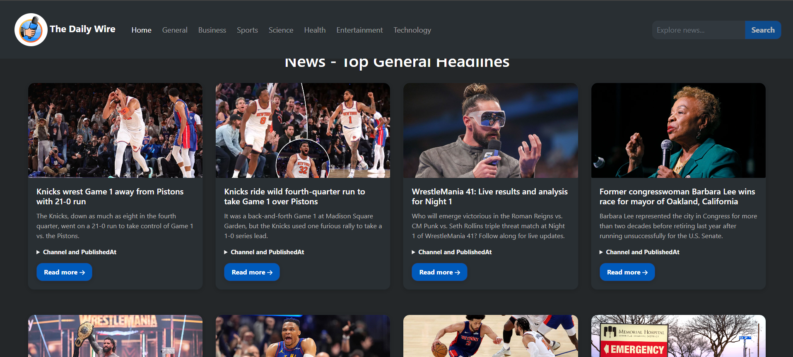

# 📰 NewsApp

NewsApp is a modern, responsive, and beautifully designed web application that delivers the latest headlines from around the world. Powered by the [GNews API](https://gnews.io), users can explore top news articles, search for specific topics, and stay updated with ease.



## 🚀 Features

- 🌍 Browse top headlines from various categories and countries
- 🔎 Search for news articles by keywords
- 💡 Light and Dark modes for better readability
- 📱 Fully responsive design across all devices
- ⚡ Smooth animations and modern UI built with React and Tailwind CSS

## 🔧 Tech Stack

- **Frontend:** React, Tailwind CSS, Framer Motion
- **API:** GNews API

## 📸 Screenshot


## 📦 Installation

```bash
git clone https://github.com/pvtumes/newsapp.git
cd newsapp
npm install
npm start
